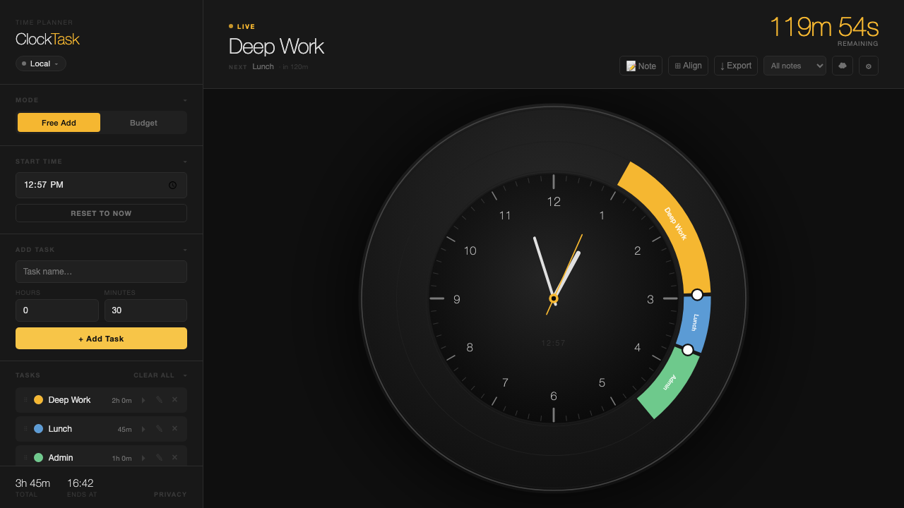
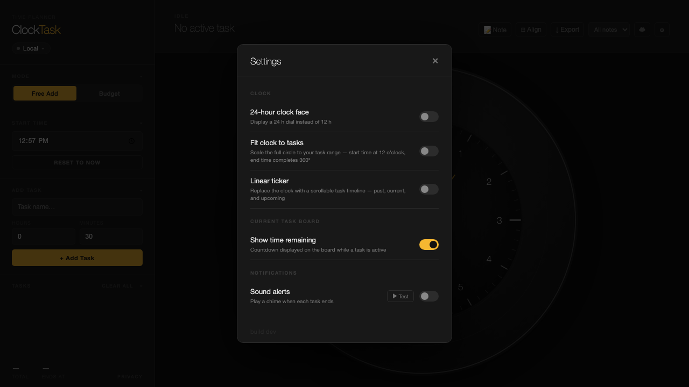
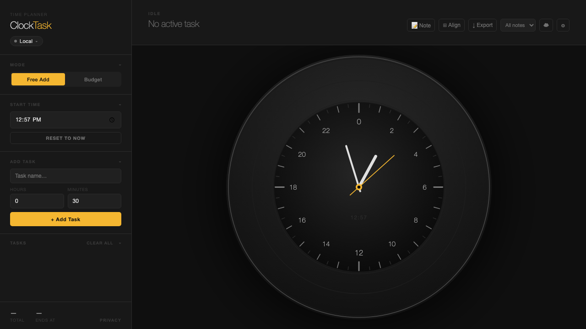
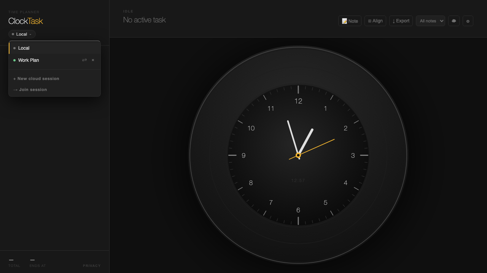

# ClockTask

A time planner that lays your day out on a clock face instead of a list. Add tasks, drag their arcs to resize, and watch a live countdown track whatever's currently running. Share a plan with someone else in real time, with fine-grained permissions on what they can see or edit.



## Features

- **Clock-face planning** — every task is an arc on a 12h or 24h dial, positioned by start time and sized by duration. Drag an arc's edge to resize it live.
- **Two ways to build a schedule** — freely add tasks one at a time, or set a total time budget and split it across tasks automatically.
- **Live task board** — a countdown to the current task's end, with a chime when it's time to move on.
- **Real-time shared sessions** — create a cloud session, share a code, and collaborators see edits sync live over WebSocket. Permissions (view/edit tasks, reorder, notes, budget, sharing) are set per share code.
- **Notes** — attach freeform notes to your plan, synced alongside tasks.
- **Linear ticker** — an optional scrollable timeline view as an alternative to the clock face.
- **PWA** — installable, works offline via a service worker.

## Screenshots

| | |
|---|---|
|  |  |
| Settings — toggle 24h face, fit-to-tasks scaling, linear ticker, chimes | 24-hour clock mode |
|  | |
| Switch between your local plan and shared cloud sessions | |

## Stack

Vanilla JS/HTML/CSS, bundled with [esbuild](https://esbuild.github.io/). No frontend framework. Backend is a [Cloudflare Worker](https://workers.cloudflare.com/) (Hono) using a Durable Object per session for state + WebSocket sync, deployed alongside a Cloudflare Pages frontend.

## Getting started

```bash
npm install
npm run dev    # frontend dev server at http://localhost:3000, with watch mode
```

Shared/cloud sessions need the backend running too, in a second terminal:

```bash
npm install --prefix backend
npm run backend:dev   # worker at http://localhost:8787, local KV
```

The frontend auto-detects `localhost` and points to the local worker; task planning without any cloud session works with just the frontend running.

```bash
npm run build  # production build → dist/
npm run lint   # ESLint on src/
npm test       # Playwright E2E suite (auto-starts the dev server)
```

## Deployment

Frontend deploys to Cloudflare Pages, backend to a Cloudflare Worker:

```bash
npm run deploy           # build + deploy frontend
npm run backend:deploy   # deploy backend worker
```

## License

[MIT](LICENSE) — free to use, modify, and distribute, provided the copyright notice is retained.
